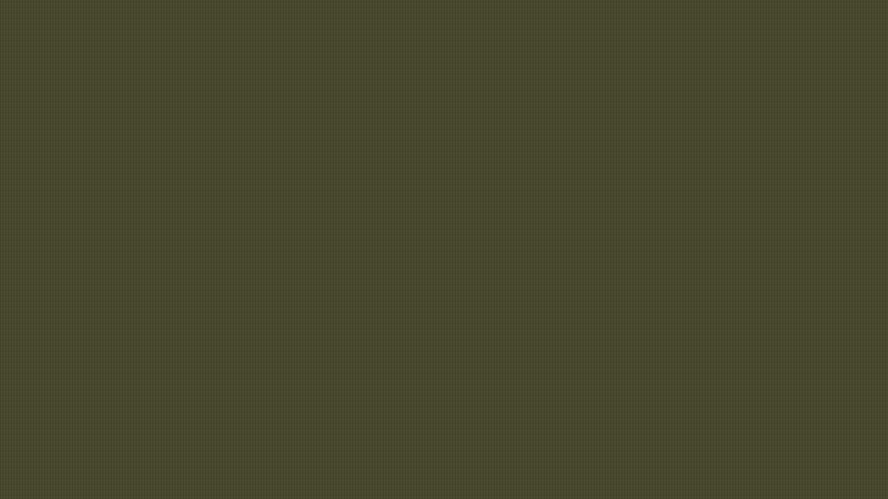

# Codes
*A copy of all my local python codes.*
1. Python是目前最主流的编程语言，面向对象编程，且可拓展性强，虽然目前的专业根本用不到，但是多学一门课程总没坏处；
2. 本人目前正在学习manimgl的数学动画制作，下面是一个小成果；
    1. 黎曼积分，由无限求和转化为积分号的数学可视化

    

3. 闲暇时候大多在寻找有趣的实例，还没找到系统性学习的方法。

*A copy of all my local markdown codes.*
1. Markdown是一种轻量级标记语言，可以让人关注内容而非排版；
2. 本人非常喜欢喜欢Markdown这种简介的语法也简约又整齐的排版，可惜本科并不用的上；
3. 记录一点点学习成果，这是[Markdown的官方教程](https://markdown.com.cn/)。

*A copy of all my local tex codes.*
1. Tex是一款优秀的文本排版系统，利用纯代码的方式定义文本排版；
2. 本人日后可能需要撰写较多的论文，Tex语言无疑是我的首选，避免Word中出现的各种隐形bug；
3. 目前计划毕业论文用Tex完成。

